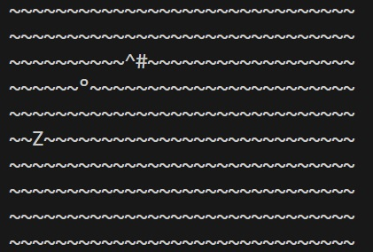

# Haispiel

**Ein einfaches Java-Spiel.**

Du spielst dieses Spiel im Terminal-Fenster.

**Anweisungen**
1. Du bist ein Hai "^" und musst zuerst das Futter "°" holen und dann das Ziel "Z" erreichen.

2. Du darfst dich aber nicht im Fischernetz "#" verfangen!

3. Du kannst dich mit der folgenden Steuerung bewegen:
  Nach oben = "w"

  Nach unten = "s"
  
  Links = "a"
  
  Recht = "d"

  Das Spiel ist soweit sehr einfach aber ich werde es verbessern. 

  Fortsetzung folgt!

  **Screenshots**

**Spielbild**

**Fast erwischt**

**Erwischt**

**Futter gekriegt und Ziel erreicht. Gewonnen**

